# Zyr - AI

**`[Your role — e.g. AI Engineer]` · AI Systems & Developer Tooling**

Building AI systems end to end — agent frameworks in Go, LLM tooling, and multi-agent applications.

  

---

## About

- Based in `[City]`, Vietnam
- `[Education — e.g. B.Eng. in ...]`
- Focus areas: AI agent frameworks, LLM application infrastructure, developer experience

## Current Focus

- Composable agent libraries in Go — [agentcore](https://github.com/zyr-ai/agentcore)
- Unified LLM access tooling in Go — [litellm](https://github.com/zyr-ai/litellm)
- Multi-agent AI applications (plan → draft → review → polish pipelines)

## Selected Work

| Area | Work |
| --- | --- |
| Agent Framework | [agentcore](https://github.com/zyr-ai/agentcore) — a minimal, composable Go library for building AI agent applications |
| LLM Tooling | [litellm](https://github.com/zyr-ai/litellm) — LiteLLM for Go: the easiest way to write LLM-based programs in Go |
| AI Applications | Multi-agent AI writing CLI — private, in development |

## Tech Stack

| Languages | AI & LLM | Tooling |
| --- | --- | --- |
| Go, `[+ others]` | LLM APIs (OpenAI, OpenRouter), local models (Ollama) | CLI / TUI, multi-agent orchestration, `[+ your tools]` |

## Experience

**`[Company]`** — `[Role]` · `[dates]`
- `[What you built / shipped]`

## Contact

| Platform | Link |
| --- | --- |
| Email | [zyren.novem@gmail.com](mailto:zyren.novem@gmail.com) |
| GitHub | [github.com/zyr-ai](https://github.com/zyr-ai) |
| LinkedIn | `[your LinkedIn]` |

---

## Status Window

*[ SYSTEM NOTIFICATION ] You have been chosen as a Player.*

<!-- AWAKEN:START -->
<!-- Generated by git-profile-awaken. Edit awaken.json instead of this block. -->

<!-- AWAKEN:END -->
