# Nhi (Zyr)

**First-year CS student at CTUT · Python-first, building AI tooling**

Building AI tooling in public — agent frameworks, LLM toolkits, and side quests.

 

---

## About

- Based in Can Tho, Vietnam
- Focus areas: AI systems and tooling, Python, and learning in public

## Current Focus

- Learning Go by building real things: [agentcore](https://github.com/zyr-ai/agentcore) and [litellm](https://github.com/zyr-ai/litellm)
- Python-first for AI experiments, scripting, and anything fun
- Multi-agent AI applications (plan → draft → review → polish pipelines)

## Selected Work

| Area | Work |
| --- | --- |
| Agent Framework | [agentcore](https://github.com/zyr-ai/agentcore) — a minimal, composable Go library for building AI agent applications |
| LLM Tooling | [litellm](https://github.com/zyr-ai/litellm) — LiteLLM for Go: the easiest way to write LLM-based programs in Go |
| AI Applications | Multi-agent AI writing CLI — private, in development |

## Tech Stack

| Languages | AI & LLM | Tooling |
| --- | --- | --- |
| Python (favorite) · Go, C/C++, TypeScript, Rust (learning) | LLM APIs (OpenAI, OpenRouter) · local models via Ollama | Docker · Linux · VS Code |

## Education

**Can Tho University of Technology (CTUT)** — B.Sc. in Computer Science · First-year

## Contact

| Platform | Link |
| --- | --- |
| Email | [zyren.novem@gmail.com](mailto:zyren.novem@gmail.com) |
| GitHub | [github.com/zyr-ai](https://github.com/zyr-ai) |

---

## Status Window

*[ SYSTEM NOTIFICATION ] You have been chosen as a Player.*

<!-- AWAKEN:START -->
<!-- Generated by git-profile-awaken. Edit awaken.json instead of this block. -->

<picture><source media="(prefers-color-scheme: dark)" srcset="awaken/hunter-dark.svg"><source media="(prefers-color-scheme: light)" srcset="awaken/hunter-light.svg"></picture>

<picture><source media="(prefers-color-scheme: dark)" srcset="awaken/ladder-dark.svg"><source media="(prefers-color-scheme: light)" srcset="awaken/ladder-light.svg"></picture>

<picture><source media="(prefers-color-scheme: dark)" srcset="awaken/web-dark.svg"><source media="(prefers-color-scheme: light)" srcset="awaken/web-light.svg"></picture>
<picture><source media="(prefers-color-scheme: dark)" srcset="awaken/skills-dark.svg"><source media="(prefers-color-scheme: light)" srcset="awaken/skills-light.svg"></picture>

<!-- AWAKEN:END -->
